# MeshChat user manual

MeshChat is an IRC-style web client for [MeshCore](https://meshcore.co.uk) companion radios. It is a single HTML file: no server, no installation, no external resources. Open it in Chrome or Edge and connect your node over USB (Web Serial) or Bluetooth (Web Bluetooth). Everything you see (messages, contacts, settings, map tiles) is stored in your browser only.

The hosted version, installable as an app, lives at **<https://chat.meshmanager.net>**. The same file can be downloaded from there ("Download meshchat.html" in the About dialog) and used standalone.

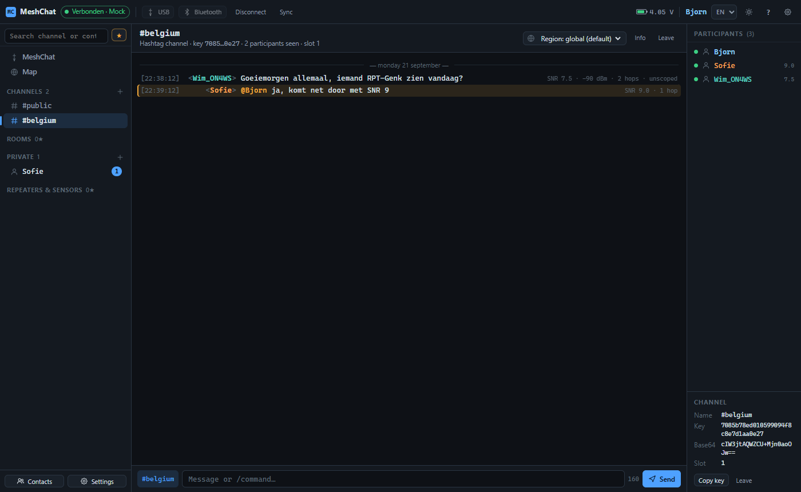

## 1. Connecting

| Button | What it does |
|---|---|
| **USB** | Opens the browser's serial-port picker. Choose the COM port of your node. |
| **Bluetooth** | Opens the Bluetooth picker. Choose your node. On Windows the first attempt asks for the pairing PIN (default `123456`); if that first attempt fails, simply click Bluetooth again. The node must not be connected to the phone app at the same time. |
| **TCP/IP** | For a WiFi companion (ESP32 firmware built with `WIFI_SSID`, TCP port 5000), like the official app. Browsers cannot open raw TCP sockets, so a small bridge translates WebSocket to TCP: run `python src/tools/meshchat-bridge.py <node-ip>` on your PC (standard library only) or `websocat -b ws-l:127.0.0.1:5005 tcp:<node-ip>:5000`, then pick or enter the bridge in the TCP/IP window (saved connections with a name, last used on top). From an https page the browser only allows an insecure `ws://` to localhost. For a bridge on another machine (a Pi next to the node, say) start it with `--tls cert.pem key.pem` (self-signed is fine: `openssl req -x509 -newkey rsa:2048 -nodes -keyout key.pem -out cert.pem -days 3650 -subj /CN=meshchat-bridge`), open `https://<bridge>:5005/` once in the browser to accept the certificate, then connect to `wss://<bridge>:5005`. |
| **Disconnect** | Closes the link. |
| **Sync** | Drains the node's message queue immediately (normally this happens automatically). |

After connecting, the status window shows the node model, firmware and radio settings. Contacts and channels are loaded (incrementally after the first time), the clock is synchronised if needed, and rooms with "auto login" are logged in.

If the browser blocks Web Serial/Bluetooth on a local file, host the file over https or `localhost`. Chrome and Edge work on desktop and Android; on iOS only Bluetooth works, through the Bluefy browser.

## 2. Windows

The left sidebar lists your windows, IRC style:

- **MeshChat** (status window): connection info, system notices, and a place for slash commands.
- **Map**: see section 6.
- **Channels**: `#public`, hashtag channels and private channels. `+` adds one.
- **Rooms** (`&name`): MeshCore room servers. The dot shows whether you are logged in.
- **Private**: direct conversations you opened or received.
- **Repeaters & sensors**: each one is a console window.

The search field above the tree filters everything while you type (Enter opens the first hit). The ★ button toggles between *favourites only* (the favourites flag stored on your node, same as the official app) and *all contacts*. Right-click any item for more actions.

### Channels

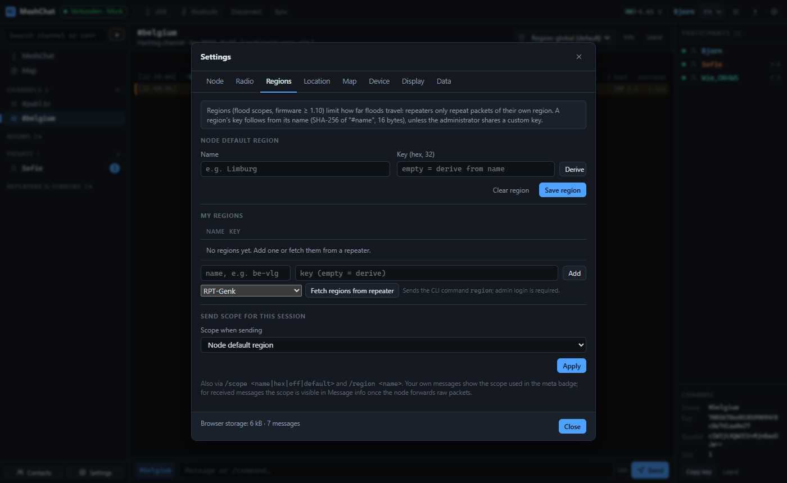

Channel types:

- **Hashtag** (`#name`): the key is derived from the name, so anyone who knows the name can join. Compatible with the official app.
- **Private with key**: a shared 128-bit key (hex or base64) as shown by the official app; the name is free.
- **Private with password**: the key is derived from a password (MeshChat convention; share the key from the info panel with users of other apps).
- **Public**: the default channel with the fixed key.

Each channel header has a **region selector** (globe icon): send this channel's messages with the node's default region, without a scope, or with any other region. MeshChat switches the node's send scope automatically right before each message.

### Rooms

Log in with `/login password` (or the Login button). Plain text is then a post. Room posts show the author's name. **Fetch history again** (info panel or right-click) removes and re-adds the room contact so its sync point resets, then logs in again; the room server pushes its stored posts and duplicates are filtered.

### Private messages

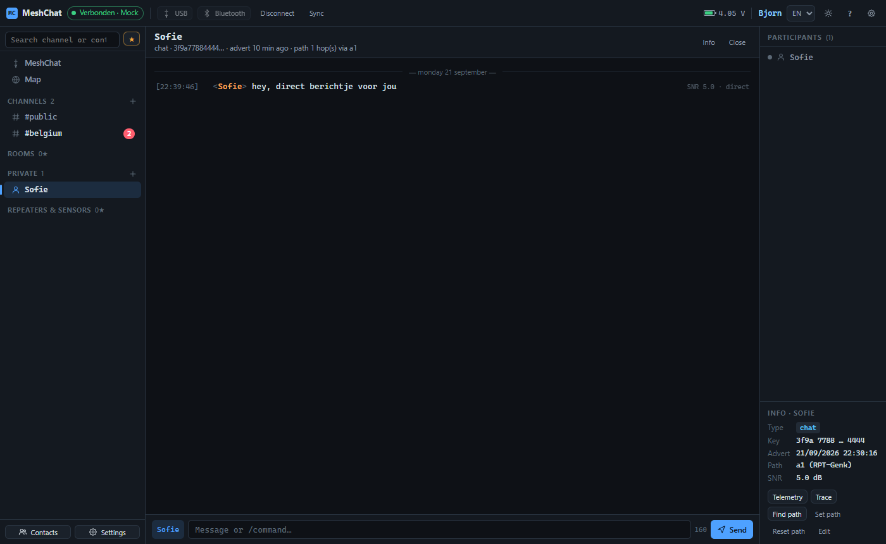

Direct messages are acknowledged (✓). Delivery is retried automatically: "attempt 2/3" appears in the line, and from the second attempt the path is cleared so the message goes as flood. The number of attempts is in Settings › Node (0 = off). ✗ appears only after the last attempt; right-click gives **Resend**.

### Repeaters and sensors

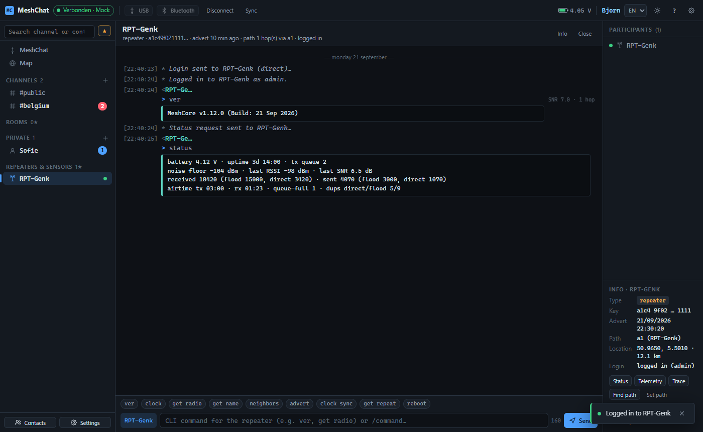

Plain text in a repeater window is sent as a CLI command (`ver`, `get radio`, `neighbors`, `advert`, …). Log in first with the admin password. Quick-command chips sit above the input. The info panel offers **Status** (statistics), **Neighbours** (sends `neighbors` and draws them on the map), **Status window**, **Telemetry**, **Trace** (SNR per hop), **Find path**, **Set path** and **Reset path**.

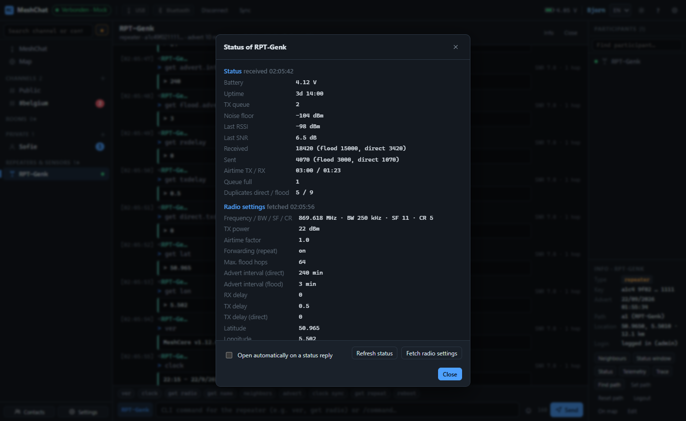

The **status window** shows the last status reply as a table (battery, uptime, noise floor, counters, airtime, duplicates) and, after *Fetch radio settings*, the radio configuration (`get radio`, `get tx`, `get af`, `get repeat`, advert intervals, delays, position, `ver`, `clock`; some values need an admin login). A **Details** button appears under every status reply in the window; tick *Open automatically on a status reply* inside the window if you prefer it to pop up by itself. Key prefixes in CLI replies (for example in `neighbors`) are annotated with the contact name when known.

## 3. Messages

Each line shows the time, the sender and the message. To the right: SNR, RSSI, hop count and scope where known. Your own messages show:

- **heard via <repeater>** as soon as your node hears a repeater rebroadcast your packet; **not heard** after 15 s (right-click › *Resend (same line)*).
- **attempt n/m**, ✓ or ✗ for acknowledged messages.

Right-click, double-click or long-press a line for **Message info**: delivery state, raw route, transport codes (region), the full path with repeater names and the raw packet in hex. Tab completes names, ↑ recalls earlier input, `@name` highlights someone.

## 4. Paths

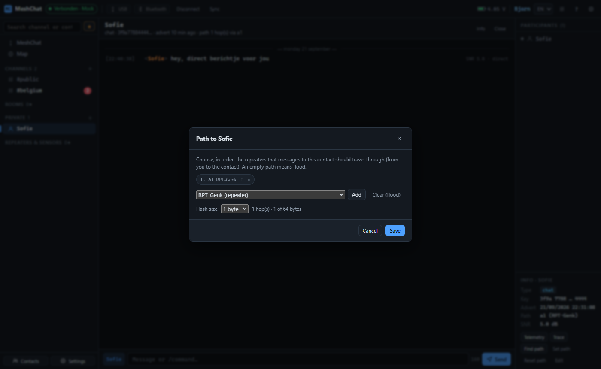

Every contact has an outgoing path (the repeaters a direct message travels through) or *flood*. **Find path** asks the node to discover it; **Set path** lets you compose it by hand: pick repeaters from your contacts in order, move them up, remove them, or clear to flood. The hash size (1–3 bytes) follows the node's path-hash mode (Settings › Radio).

## 5. Contacts

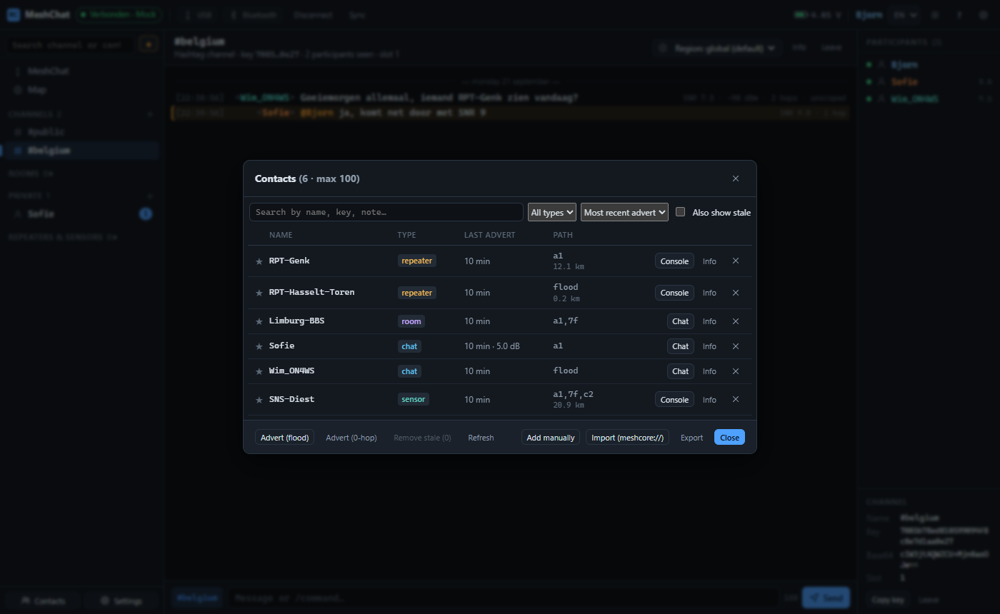

The Contacts dialog supports searching, filtering by type, sorting (recent, name, type, distance), favourites (synchronised with the node), a local alias and note per contact, changing the type and telemetry permissions, share-URI export, sharing on the mesh, manual adding by public key, `meshcore://` import, approving pending adverts when *manual add* is on, and pruning stale contacts.

## 6. Map

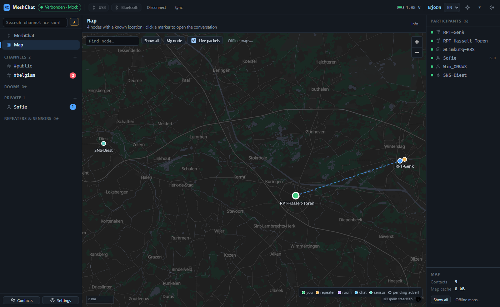

The map shows every contact with a known position (from its advert) plus your own node, coloured by type. Pending adverts appear as hollow markers with a "?". Click a marker for a popup with *Open* and *Info*; right-click a contact anywhere for *Show on map*. With **Live packets** enabled, packets your node hears are animated along the path of repeaters towards you.

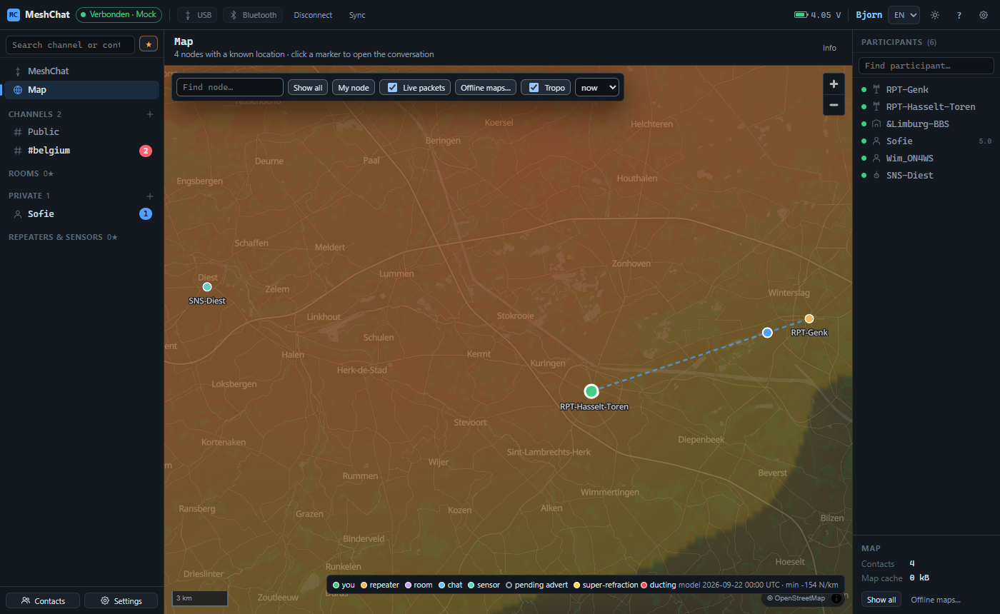

**Tropo** (off by default, needs internet) overlays an estimate of tropospheric ducting from the Open-Meteo weather model. The field comes as one small JSON from meshmanager.net, which computes it from the DWD ICON-EU model (every 3 hours, 0.25° grid, pressure levels 1000/950/925/900/850 hPa, refractivity gradient dN/dh) for the whole ICON-EU domain (23° W to 62° E, 29° to 70° N); the legend names the model run; if that server is unreachable the app computes a grid around the map view itself from Open-Meteo. The colour scale follows the Hepburn maps of dxinfocentre.com: purple 1 marginal, blue 2 fair, green 3 moderate, lime 4 high, yellow 5 strong, amber 6 very strong, orange 7 intense, red 8 very intense (ducting, below -157 N/km), pink 9-10+ extreme; normal air (above -60 N/km; -40 is standard) stays transparent. Hover the Tropo button or the legend for this explanation. Pick *now* or +6/+12/+24 hours and set the opacity with the slider (0 to 40 %, default 30, remembered on this device). Because the grid is fixed, the same place keeps the same colour when you pan or zoom; results are cached per point and hour, and if Open-Meteo answers with 429 (rate limit) the overlay waits a minute before retrying. The last fetched points are stored in the browser, so offline the overlay shows the last known situation and the legend says so with the model hour; only the weather data needs internet, never the map itself. Layers are about 700 m thick, so thin ground ducts stay invisible. The server field is calibrated against the Hepburn maps of dxinfocentre.com: super-refraction is taken over layers of at least 500 m, a thin layer counts fully only when it really traps (a duct, below -157 N/km), and for MeshCore's 868 MHz the nocturnal ground inversion over land counts at half weight, because rooftop nodes sit inside it and do gain range while Hepburn, aimed at elevated antennas, ignores it. It is a model estimate, not a measurement.

Tiles come from the self-hosted OpenStreetMap vector tiles of meshmanager.net and are cached in the browser. **Settings › Map** lets you preload the whole of Western Europe at overview zoom plus selected countries in high resolution; the size is shown next to each country, with a total and a progress bar. Pin the storage so the browser never evicts it. Offline without a cache, the map shows a notice; the rest of the app keeps working.

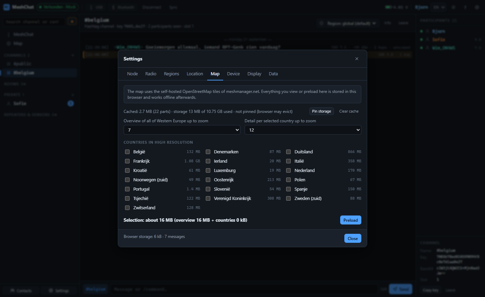

## 7. Settings

- **Node**: name (emoji and flags allowed, max. 31 UTF-8 bytes, a flag counts 8), manual/auto add of contacts, telemetry sharing, multi-ACK, automatic resend attempts.
- **Radio**: frequency, bandwidth, spreading factor, coding rate, TX power, presets, client repeat, path-hash size, tuning.
- **Regions**: the node's default region (flood scope), your list of regions with keys, *fetch regions from a repeater* (CLI `region`), and the send scope for this session.
- **Location**: your position (also from the browser) and whether adverts include it.
- **Device**: firmware, time sync, reboot, Bluetooth PIN, private key export/import, factory reset.
- **Display**: language (NL/EN/FR), theme, timestamps, meta badges, notifications, debug frames.
- **Data**: export and import the complete configuration as JSON (node settings, channels with keys, contacts, local preferences; optionally the private key), export or clear the history.

## 8. Commands

Type `/` to see the list with explanations. The most used:

| Command | Purpose |
|---|---|
| `/join #name` · `/join name key` | add a channel |
| `/part` | remove the channel from the node |
| `/msg name text` · `/query name` | private message / window |
| `/login pw` · `/logout` | room or repeater login |
| `/status` · `/telemetry` · `/trace` · `/path` · `/setpath` · `/resetpath` | node diagnostics for the open contact |
| `/advert` · `/advert flood` | send your advert |
| `/scope name\|off\|default` · `/region name` · `/regions` | send scope, default region, fetch regions |
| `/sync` · `/resync` | drain the queue / fetch room history again |
| `/map [name]` | open the map or show a contact on it |
| `/nick` · `/whois` · `/names` · `/list` · `/time` · `/battery` · `/stats` · `/debug` · `/clear` | misc |

## 9. Offline and updates

Nothing in MeshChat needs the network to function: the node link is local, history and settings live in the browser, and map tiles are served from the cache once loaded. The network is only used to fetch updates and new tiles.

The hosted version is a PWA: install it from the browser's address bar. It fetches the newest version on every start and shows a *reload* notice when an update arrives while it is open.

## 10. Small screens

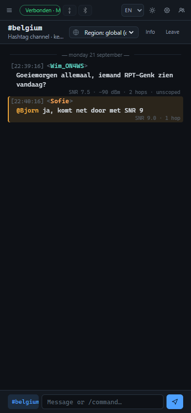

Below 900 px the sidebars become slide-in panels (☰ and 👥 buttons), message lines wrap into two rows and dialogs use the full width. Everything, including the map and the settings, works on a phone.
